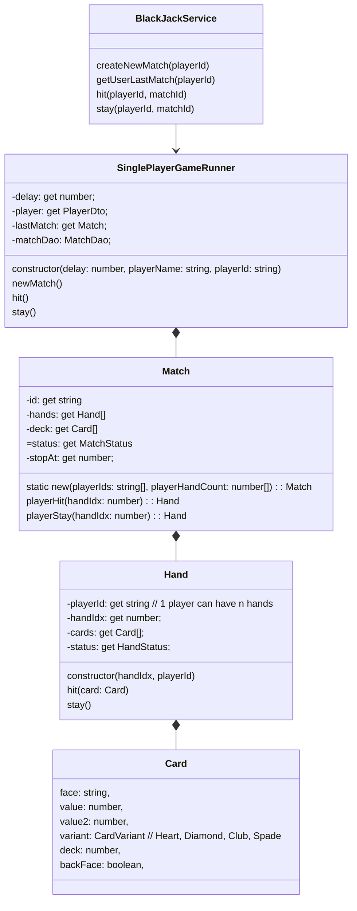

# Class design

```mermaid
classDiagram
    %% Relation	Description
    %% <|--	    Inheritance
    %% *--	    Composition
    %% o--	    Aggregation
    %% -->	    Association

    BlackJackService --> SinglePlayerGameRunner
    SinglePlayerGameRunner *-- Match
    Match *-- Hand
    Hand *-- Card

    class BlackJackService {
        createNewMatch(playerId)
        getUserLastMatch(playerId)
        hit(playerId, matchId)
        stay(playerId, matchId)
    }

    class SinglePlayerGameRunner {
        -delay: get number;
        -player: get PlayerDto;
        -lastMatch: get Match;
        -matchDao: MatchDao;

        constructor(delay: number, playerName: string, playerId: string)
        newMatch()
        hit()
        stay()
    }
    class Match{
        -id: get string
        -hands: get Hand[]
        -deck: get Card[]
        =status: get MatchStatus
        -stopAt: get number;
        
        static new(playerIds: string[], playerHandCount: number[]): Match
        playerHit(handIdx: number): Hand
        playerStay(handIdx: number): Hand
    }
    class Hand{
        -playerId: get string // 1 player can have n hands
        -handIdx: get number;
        -cards: get Card[];
        -status: get HandStatus;

        constructor(handIdx, playerId)
        hit(card: Card)
        stay()
    }

    class Card{
        face: string,
        value: number,
        value2: number,
        variant: CardVariant // Heart, Diamond, Club, Spade
        deck: number,
        backFace: boolean,
    }

```
